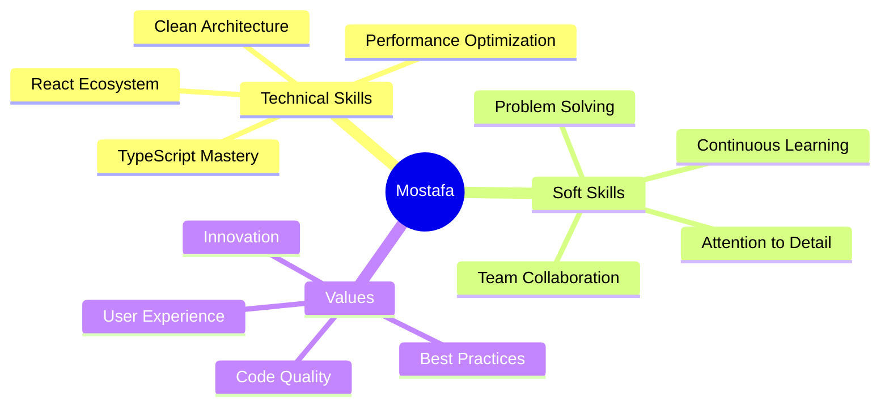

<div align="center">

<!-- Header Animation -->


<br/>

<!-- Animated Badges -->
<p>
  
  
  
</p>

<!-- Social Links with Hover Effect -->
<p>
  <a href="YOUR_LINKEDIN">
    
  </a>
  <a href="YOUR_PORTFOLIO">
    
  </a>
  <a href="mailto:melfeshawy42@gmail.com">
    
  </a>
  <a href="YOUR_TWITTER">
    
  </a>
</p>


</div>

---

## 🎭 About Me

```typescript
interface Developer {
  name: string;
  role: string;
  location: string;
  languages: string[];
  currentMission: string;
  passions: string[];
  availability: boolean;
}

const mostafa: Developer = {
  name: "Mostafa Mosad Al-Tonbary",
  role: "Front-End Developer & React.js Specialist",
  location: "Egypt 🇪🇬",
  languages: ["JavaScript", "TypeScript", "HTML", "CSS"],
  currentMission: "Building scalable, high-performance web applications",
  passions: [
    "Clean Architecture 🏗️",
    "Performance Optimization ⚡",
    "User Experience 🎨",
    "Open Source 💚"
  ],
  availability: true
};

console.log("Let's build something amazing together! 🚀");
```

<br/>

<div align="center">
  
</div>

---

## 🎯 Current Focus

<table>
<tr>
<td width="50%">

### 🚀 What I'm Building
- 🔥 High-performance React applications
- ⚡ Next.js optimization techniques
- 🎨 Stunning UI/UX implementations
- 🏗️ Scalable frontend architectures

</td>
<td width="50%">

### 📚 What I'm Learning
- 🧠 Advanced design patterns
- 🔄 State management mastery
- 🎭 Micro-frontend architectures
- 📊 Web performance metrics

</td>
</tr>
</table>

<div align="center">
  
</div>

---

## 🛠️ Tech Stack & Tools

<div align="center">

### 💎 Core Technologies

<table>
<tr>
<td align="center" width="96">

<br>React
</td>
<td align="center" width="96">

<br>Next.js
</td>
<td align="center" width="96">

<br>TypeScript
</td>
<td align="center" width="96">

<br>JavaScript
</td>
<td align="center" width="96">

<br>HTML5
</td>
<td align="center" width="96">

<br>CSS3
</td>
</tr>
</table>

### 🎨 Styling & Design

<table>
<tr>
<td align="center" width="96">

<br>Tailwind
</td>
<td align="center" width="96">

<br>Material UI
</td>
<td align="center" width="96">

<br>Sass
</td>
<td align="center" width="96">

<br>Styled Comp
</td>
<td align="center" width="96">

<br>Bootstrap
</td>
<td align="center" width="96">

<br>Figma
</td>
</tr>
</table>

### 🔧 State Management & Tools

<table>
<tr>
<td align="center" width="96">

<br>Redux
</td>
<td align="center" width="96">

<br>Git
</td>
<td align="center" width="96">

<br>GitHub
</td>
<td align="center" width="96">

<br>Vite
</td>
<td align="center" width="96">

<br>Webpack
</td>
<td align="center" width="96">

<br>npm
</td>
</tr>
</table>

</div>

<br/>

<div align="center">
  
</div>

---

## 📊 GitHub Statistics

<div align="center">
  
  
  
  
</div>

<div align="center">
  
  
</div>

<br/>

<div align="center">
  
</div>

---

## 🏆 Featured Projects

<div align="center">

<table>
<tr>
<td width="50%">

### 🌟 [Project Alpha](LINK)
**A revolutionary web application**

`React` `Next.js` `TypeScript` `Tailwind`

Modern, fast, and scalable. Built with cutting-edge technologies to deliver exceptional user experience.

⭐ **Key Features:**
- Lightning-fast performance
- Responsive design
- SEO optimized

[View Demo](LINK) | [Source Code](LINK)

</td>
<td width="50%">

### 🚀 [Project Beta](LINK)
**E-commerce platform reimagined**

`React` `Redux` `Material-UI` `Firebase`

Full-featured shopping experience with real-time updates and seamless checkout process.

⭐ **Key Features:**
- Real-time inventory
- Payment integration
- Admin dashboard

[View Demo](LINK) | [Source Code](LINK)

</td>
</tr>

<tr>
<td width="50%">

### ⚡ [Project Gamma](LINK)
**Social media dashboard**

`Next.js` `React Query` `Framer Motion`

Analytics dashboard with beautiful animations and real-time data visualization.

⭐ **Key Features:**
- Real-time analytics
- Beautiful UI/UX
- Advanced filtering

[View Demo](LINK) | [Source Code](LINK)

</td>
<td width="50%">

### 🎨 [Project Delta](LINK)
**Creative portfolio showcase**

`React` `Three.js` `GSAP` `Tailwind`

3D interactive portfolio with smooth animations and stunning visual effects.

⭐ **Key Features:**
- 3D interactions
- Smooth animations
- Dark/Light mode

[View Demo](LINK) | [Source Code](LINK)

</td>
</tr>
</table>

</div>

---

## 🎯 What I Bring to the Table

<div align="center">



</div>

---

## 🤝 Let's Connect & Collaborate

<div align="center">

### 💬 Open for opportunities, collaborations, and interesting conversations!

<br/>

<table>
<tr>
<td align="center">
<a href="YOUR_LINKEDIN">

</a>
</td>
<td align="center">
<a href="YOUR_PORTFOLIO">

</a>
</td>
</tr>
<tr>
<td align="center">
<a href="mailto:melfeshawy42@gmail.com">

</a>
</td>
<td align="center">
<a href="YOUR_GITHUB">

</a>
</td>
</tr>
</table>

<br/>

### 📫 Quick Reach

📧 **Email:** melfeshawy42@gmail.com  
🔗 **LinkedIn:** [Connect with me](YOUR_LINKEDIN)  
🌐 **Portfolio:** [View my work](YOUR_PORTFOLIO)

<br/>


</div>

---

## 💝 Support My Work

<div align="center">

If you find my work valuable and want to support my journey:

[](YOUR_COFFEE_LINK)
[](YOUR_PAYPAL)

**Your support motivates me to create more amazing projects! 🙏**

</div>

---

<div align="center">

### 💭 Philosophy

**"The best code is no code at all. The second best is simple, readable code."**

**"First, solve the problem. Then, write the code."**

<br/>


<br/><br/>


<br/>

### ⭐ If you like my work, consider giving my repos a star!

**Made with ❤️ by Mostafa Mosad Al-Tonbary**

<br/>


</div>
